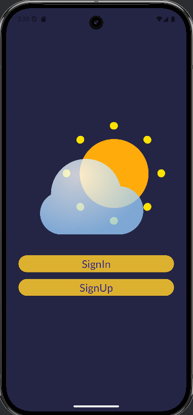
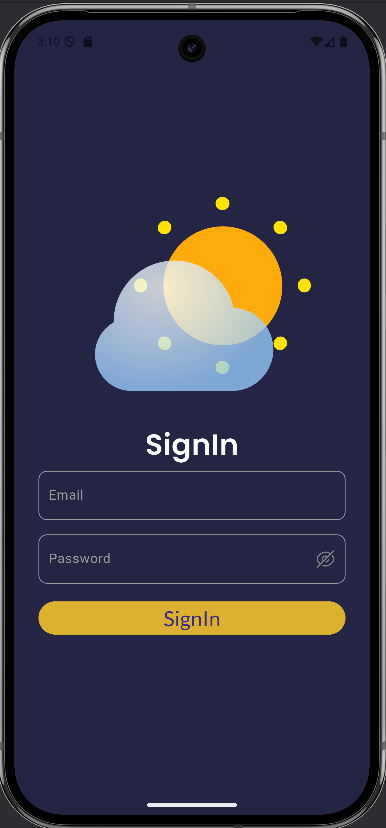
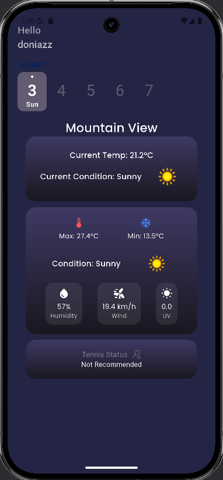

# weather_app

A mobile app that built with flutter. it helps users to know weather forecast 
and also predict if the weather is suitable for tennis or not.

## Main packages used

- [http](https://pub.dev/packages/http) to make integration with API
- [supabase_flutte](https://pub.dev/packages/supabase_flutter) for authentication and database
- [flutter_bloc](https://pub.dev/packages/flutter_bloc) as state management
- [injectable](https://pub.dev/packages/injectable) to make dependency injection
- [flutter_screenutil](https://pub.dev/packages/flutter_screenutil) for adapting screen and font size

## Folder structure
I Have applied clean architecture concept With MVVM architecture

## App ScreenShots

Here are some screenshots for the application:

### 📽️ Demo Video

[▶️ Watch the video](https://drive.google.com/file/d/1coQlb9TF99-YKai08c1HibTitwO5G_3e/view?usp=drive_link)

